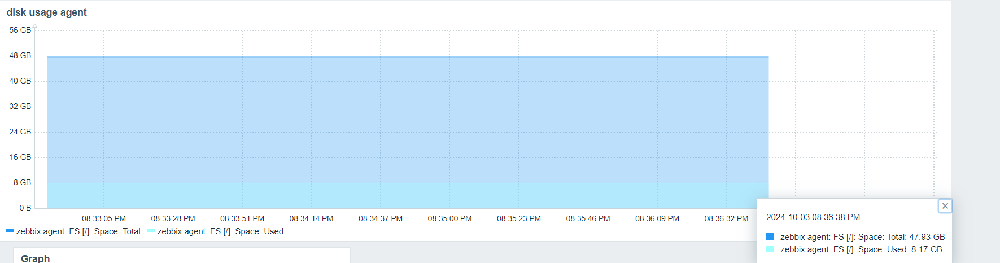
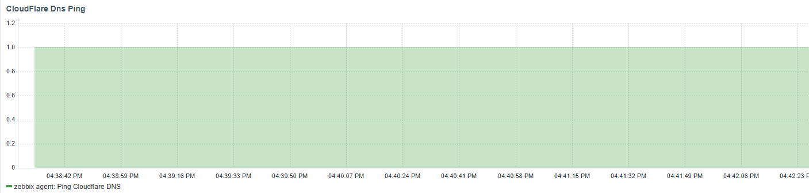

## step 1- Install VirtualBox:

## step 2- Download Ubuntu server , LTS version: 
Download the latest LTS version of Ubuntu Server from the official website.
: https://ubuntu.com/download/server

Create a new virtual machine in VirtualBox and install the Ubuntu Server on it:

after finish, do the following command in order to verify it:
```
more /etc/os-release
```
the output should be: 


make sure to create two separate virtual machines: one for the Zabbix Server and one for the Zabbix Agent.

why: 
1. Separation of Roles
2. Resource Isolation
3. Security
4. Scalability
5. Simplified Troubleshooting and Maintenance:


find out the ip of each vm, and ssh the vm from the cmd (make sure to configure the ssh in the installation process)


## step 3- Install Zabbix Server:
 
use this guide: https://www.zabbix.com/download?zabbix=7.0&os_distribution=ubuntu&os_version=24.04&components=server_frontend_agent&db=pgsql&ws=nginx


to install PostgreSQL as the database for Zabbix, do the following commands:
```
sudo apt install postgresql postgresql-contrib
sudo systemctl start postgresql
sudo systemctl enable postgresql
```

## step 4- Access the Zabbix Frontend
```
http://server_ip
```
After successful configuration, log in with the default credentials: Admin and zabbix.

## step 5- Install Zabbix agent :
Switch to the second vm for the Zabbix agent installation.

use this guide: https://www.zabbix.com/download?zabbix=7.0&os_distribution=ubuntu&os_version=24.04&components=agent&db=&ws=

## step 6- Adding the Zabbix Agent in the Zabbix Server Web Interface :
- Navigate to Configuration > Hosts.
- Click on Create host.
- Fill in the host details:
    - Host name: set any convenient name for the Zabbix agent to display in the Zabbix server web interface.

    - Groups: create a new group or select an existing one. Groups are used for organizational purposes and to assign access rights to data.

    - Templates: select a template that is used exactly like the agent installed on the server.

    - Interfaces: Add the IP address or domain name of the Zabbix agent host.

    If using an IP address, you must enter it in the IP address field and select IP in the Connect to section.

    If using a domain name, you must enter the name in the DNS name section and select DNS in in the Connect to section.

- Update and verify: The agent will appear in the list and metrics will be available under Monitoring > Hosts > Graphs.

## step 7- Monitoring Disk Usage of Zabbix Agent:


1. Create a new item on the Zabbix Agent host that monitors disk usage.

    - This item should gather information on the available disk space for a specific partition (such as the root partition /).

2. Visualize the data:

    - You can monitor disk usage data in the Zabbix interface by viewing the latest data or creating graphs to track disk usage over time.





## step 8-Monitoring Cloudflare DNS Availability:


1. Create a new item that sends ping requests to the Cloudflare DNS server (1.1.1.1).

    - This item checks the availability of the DNS by pinging its IP address.

2. Visualize the data:

    - You can monitor the availability of the DNS data in the Zabbix interface by viewing the latest data or creating graphs to track the item over time.


